# Software Requirements Specification (SRS)
## Project: NEXUS - Mentor-Mentee Platform
### AI-Driven Job Matching & Educational Exchange Ecosystem

---

**Document Control**

**Document Information**
| Title | Software Requirements Specification for NEXUS Platform |
| :--- | :--- |
| Date | May 2025 |
| Status | Final Draft |
| Version | 4.5.0-PLATINUM |
| Prepared for | Mentor and Students of University |
| Reference | SRS_NEXUS_V4.5_May_2025 |

**Team Members and Roles**
| Role | Name | ID |
| :--- | :--- | :--- |
| Product Owner | Pari Chaudhari | 24BCP111 |
| Scrum Master | Arya Shah | 24BCP100 |
| Developer | Harsh Patel | 24BCP102 |
| Developer | Het Gabani | 24BCP131 |

**Disclaimer:**
Version 4.5 incorporates major system updates including Analytics, Announcements, and Medical Leave architectures. This document serves as the comprehensive "Source of Truth" for the architecture, functionality, and constraints of the NEXUS platform. It encapsulates all technical decisions needed for robust delivery, scalability, and long-term maintenance.

---

## Table of Contents
1. **Introduction**
   1.1. Purpose
   1.2. Document Conventions
   1.3. Intended Audience
   1.4. Project Scope
   1.5. References
2. **Overall Description**
   2.1. Product Perspective
   2.2. Product Functions
   2.3. User Classes, Characteristics, and Needs
   2.4. Operating Environment
   2.5. Design and Implementation Constraints
   2.6. User Documentation
   2.7. Assumptions and Dependencies
3. **System Features and Functional Requirements**
   3.1. User Management and Authentication
   3.2. Role-Based Dashboards & Interfaces
   3.3. Mentee Management & Cohort Analytics
   3.4. Synergistic Communication Engine
   3.5. Intelligent Session Orchestrator
   3.6. Mission & Assignment Lifecycle
   3.7. Medical Leaves Management
   3.8. Global Announcements System
   3.9. Analytics & Metrics Module
   3.10. Mentor Application & Onboarding Workflow
   3.11. Settings & Profile Management
   3.12. Resource Repository Management
   3.13. Textual Use Case Descriptions
4. **External Interface Requirements**

   4.1. User Interfaces
   4.2. Hardware Interfaces
   4.3. Software Interfaces
   4.4. Communications Interfaces
5. **Non-Functional Requirements**
   5.1. Performance Requirements
   5.2. Security Requirements
   5.3. Safety Requirements
   5.4. Reliability and Availability
   5.5. Usability and Accessibility
   5.6. Maintainability and Portability
   5.7. Legal and Compliance Requirements
   5.8. Operational Requirements
   5.9. Error Handling Requirements
6. **Other Requirements**

   6.1. Data Migration
   6.2. Internationalization Requirements
   6.3. Training Requirements
   6.4. Future Scope
   6.5. Risk Analysis
7. **Appendices**

   7.1. Appendix A: Analysis Models (Architectural Diagrams)
       A.1. Use Case Diagrams
       A.2. Session Booking Sequence Diagram
       A.3. Data Flow Diagrams (DFD)
       A.4. Deployment Architecture
       A.5. Logical Component Diagram
       A.6. Activity Diagram (Session Booking Flow)
       A.7. State Diagram (Assignment Lifecycle)
       A.8. State Diagram (Leave Request Lifecycle)
       A.9. Sequence Diagram (Leave Submission Flow)
   7.2. Appendix B: Full-Fidelity Database ERD (v4.5)
   7.3. Appendix C: High-Level Class Architecture
   7.4. Appendix D: Glossary
   7.5. Appendix E: SDLC Documentation (Waterfall Phases)
   7.6. Appendix F: Submission & Presentation Checklist

---

## 1. Introduction

### 1.1. Purpose
The purpose of NEXUS is to facilitate smooth interaction between mentors and mentees through an organized platform. The system helps in managing mentor–mentee relationships, scheduling mentoring sessions, enabling communication, and tracking progress. It also assists administrators in monitoring mentoring activities and maintaining proper records.

This Software Requirements Specification (SRS) document provides a comprehensive and exhaustive description of the platform, ensuring all stakeholders—including software architects, developers, and project administrators—have a precise understanding of system operations, architecture, and expected deliverables.

### 1.2. Document Conventions
This document follows these conventions to specify the priority of requirements:

| Term | Description |
| :--- | :--- |
| **SHALL** | Refers to a mandatory requirement that must be fulfilled during the core implementation phase. The system will fail acceptance criteria if this is missing. |
| **SHOULD** | Indicates a highly desirable requirement that enhances the system but does not necessarily block initial deployment. |
| **MAY** | Refers to an optional requirement anticipated for future phases or nice-to-have features. |
| **TBD** | To Be Determined; indicates information that is pending further architectural review. |

**Requirement Categorization:**
- **FR-XX**: Functional Requirements
- **NFR-XX**: Non-Functional Requirements
- **IR-XX**: Interface Requirements

### 1.3. Intended Audience
This document is intended for the following stakeholders:

| Stakeholder | Role |
| :--- | :--- |
| **Project Owners / Sponsors** | Review and approve core functionalities and business logic. |
| **Software Architects** | Ensure system design aligns with specified technical constraints (Next.js, Supabase). |
| **Development Team** | Utilize functional and interface requirements for coding and implementation. |
| **QA Engineers** | Formulate test cases and validation scripts based on SHALL requirements. |
| **System Administrators** | Understand maintenance, deployment (Vercel), and operational logs. |

### 1.4. Project Scope
NEXUS aims to enhance professional and academic growth by providing structured mentorship environments. The platform utilizes a high-performance stack: **Next.js (App Router)** for the frontend, **Tailwind CSS v4** for high-fidelity UI design, and **Supabase (PostgreSQL/BaaS)** for a serverless, real-time backend architecture.

**In Scope:**
- **Identity & Access Management (IAM)**: Implementing robust email verification, role-based access control (RBAC), and session lifecycle management.
- Real-Time Synergy Module: Bidirectional WebSocket-driven communication.
- Automated Scheduler: Session lifecycle management and conflict-free booking.
- Progressive Task Tracker: Automated progress tracking via data-driven metrics.
- Asset Repository: A centralized, categorized educational materials library for secure, scalable delivery of scholarly resources.
- Data Integrity & Security: Row-Level Security (RLS) enforcement on all databases.

**Out of Scope (Phase 1):**
- Development of native iOS/Android applications (responsive web design handled first).
- Integration with external legacy university ERP systems (planned for future API expansions).
- Hardware procurement for hosting (the solution is fully cloud-native/serverless).

### 1.5. References
- Next.js Documentation (https://nextjs.org/docs)
- Supabase Documentation (https://supabase.com/docs)
- Tailwind CSS v4 Schema Documentation
- NEXUS Internal UI/UX Design Prototypes

### 1.6. Definitions, Acronyms, and Abbreviations
- **AES-256**: Advanced Encryption Standard (256-bit key) utilized for data security at rest.
- **BaaS**: Backend as a Service; cloud-integrated backend logic and storage framework (Supabase).
- **CSRF**: Cross-Site Request Forgery; an attack mitigated natively by Next.js edge routers.
- **DFD**: Data Flow Diagram; visual representation of data movement across system boundaries.
- **ERD**: Entity Relationship Diagram; logic model of the underlying PostgreSQL database schema.
- **HOC**: Higher-Order Component; a React architectural pattern used for ProtectedRoutes.
- **IAM**: Identity and Access Management; the framework for governing user authentication and permissions.
- **ISR**: Incremental Static Regeneration; a Next.js feature for high-performance content delivery.
- **JWT**: JSON Web Token; the stateless cryptographic passkey verifying user access rights.
- **OTP**: One-Time Password; a temporary secure code for account verification.
- **RBAC**: Role-Based Access Control; enforcing strict Mentor or Mentee UI access limitations.
- **RLS**: Row-Level Security; strict PostgreSQL database-level privacy walls.
- **TLS 1.3**: Transport Layer Security; the latest protocol for secure network communications.
- **TBD**: To Be Determined.

### 1.7. SDLC Methodology: The Waterfall Model
The NEXUS platform development follows a structured **Waterfall Model**, ensuring a linear and sequential flow of development phases. This approach was selected to provide high predictability and clear documentation at each stage, which is critical for an educational platform where data integrity and role-based permissions are paramount.

**Phases Implemented:**
1. **Requirements Analysis**: This SRS document represents the culmination of this phase, where all functional (FR) and non-functional (NFR) requirements were finalized before architectural design.
2. **System Design**: The architectural blueprints in Appendix A and the ERD in Appendix B define the logical structure of the platform.
3. **Implementation**: Coding of the Next.js frontend and Supabase backend logic.
4. **Integration & Testing**: Rigorous validation of the "Synergy" and "Scheduler" modules to ensure conflict-free operation.
5. **Deployment**: Staged deployment to Vercel's global edge network.
6. **Maintenance**: Post-deployment monitoring and iterative updates via PITR backups.

---

## 2. Overall Description

### 2.1. Product Perspective
NEXUS operates as a standalone web-based system designed as a modular, cloud-native application. The architecture is decoupled: the frontend is deployed globally via Vercel's Edge Network, while the backend scales independently within the managed Supabase AWS infrastructure. It directly interfaces with Cloud Storage (for assignment assets) and Mail Services (for authentication links and notifications).

### 2.2. Product Functions
The core functions of NEXUS include:
1. **Unified Authentication Engine**: Supporting email/password and Magic Links with JWT-based sliding session management.
2. **Dynamic Hierarchy Engine**: Middleware routing that adapts UI/UX instantly based on Mentor/Mentee roles via RBAC.
3. **Synergistic Mentee Management**: Cohort tracking and real-time progress monitoring for faculty.
4. **Automated Scheduler**: Coordinating synchronous interactions with conflict resolution and leave-blocking logic.
5. **Real-Time Communication**: Instant messaging capabilities between paired users using WebSocket channels.
6. **Medical Leaves Management**: Structured absence request workflows that integrate with the session scheduler.
7. **Global Announcements Engine**: Broadcast infrastructure for Mentors/Admins to reach cohorts or the entire platform.
8. **Analytics & Insights Dashboard**: Data-driven visual intelligence module tracking session attendance, task velocity, and mentee engagement trends.

### 2.3. User Classes, Characteristics, and Needs
1. **Mentees (Knowledge Seekers)**
   - **Characteristics**: Students or early-career professionals; high technical proficiency expectations.
   - **Needs**: Immediate access to guidance, simplified task management, responsive mobile experience.
2. **Mentors (Knowledge Providers)**
   - **Characteristics**: Academic faculty or industry experts; varied technical proficiency.
   - **Needs**: Efficient tools to manage large cohorts, automated scheduling to protect time, clean and organized dashboard layouts.
3. **Administrators (Infrastructure Overseers)**
   - **Characteristics**: IT staff.
   - **Needs**: Global oversight of user activity, system health monitoring, resolving account access issues.

### 2.4. Operating Environment
1. **Technical Environment**: Web-based application accessible via secure modern browsers. Hosted via Vercel (Frontend) and Supabase (Backend API/DB).
2. **Hardware Environment**: Cloud-native backend (serverless). 
   - **Client Requirements**: Minimum 4GB RAM and a Dual Core Processor for smoother CSS animations and WebSocket connections.
3. **Software Environment**: 
   - Frontend: React / Next.js 16+
   - Database: PostgreSQL (accessed via PostgREST)
   - Realtime: Supabase WebSocket Channels
4. **Network Environment**: Standard broadband connection; optimized for low-bandwidth environments via asset compression and lazy loading.
5. **User Environment**: Agnostic standard devices (Desktop, Mobile, Tablet) supporting responsive UI structures.

### 2.5. Design and Implementation Constraints
1. **Technical Constraints**: 
   - Must strictly utilize Next.js App Router paradigms for SSR (Server-Side Rendering).
   - Must route all database transactions through Supabase APIs to ensure RLS (Row Level Security) triggers apply.
2. **Regulatory Constraints**: 
   - Educational data privacy compliance (no user can scrape data from unassigned mentor-mentee pairs).
3. **Performance Constraints**: 
   - Initial Time to Interactive (TTI) must be less than 1.5 seconds on standard connections.

### 2.6. User Documentation
The system SHALL provide contextual tooltips during onboarding, an integrated Help Center regarding scheduling rules, and standard Administrator Guides for managing user bans/recoveries within the Supabase dashboard.

### 2.7. Assumptions and Dependencies
- **Assumptions**: Users have reliable internet access; Vercel edge networks remain stable globally.
- **Dependencies**: The system is highly dependent on the uptime of the Supabase platform for Auth, Database queries, and WebSocket streaming. It is also assumed that a **PostgreSQL Database Trigger** is configured to automatically synchronize new `auth.users` records into the `public.profiles` table to maintain relational integrity.

---

## 3. System Features and Functional Requirements

### 3.1. User Management and Authentication

**ID** | **Requirement**
--- | ---
**FR-01** | The system SHALL provide a multi-mode sign-in supporting secure email magic links or standard passwords. The system SHOULD support multi-factor authentication (OTP) in future versions.
**FR-02** | The system SHALL mandate role selection (Mentor or Mentee) during the initial registration process.
**FR-03** | The system SHALL implement a secure "Magic Link" password recovery mechanism sent via the verified email.
**FR-04** | The system SHALL explicitly restrict routing access based on the authenticated user's role (RBAC). 
**FR-05** | The system SHALL utilize JSON Web Tokens (JWT) with sliding expiration windows for persistent session management.
**FR-06** | The system SHALL maintain an audit log sequence within the authentication provider (GoTrue) tracking IP address and device string during login.

### 3.2. Role-Based Dashboards & Interfaces

**ID** | **Requirement**
--- | ---
**FR-07** | The system SHALL automatically route users from `/login` to either the `/mentor/dashboard` or `/mentee/dashboard` based solely on their database role metadata.
**FR-08** | The system SHALL display aggregated metrics on the Mentor dashboard, including: active mentee count, total sessions held, and average task completion rate of current cohorts.
**FR-09** | The system SHALL display actionable insights on the Mentee dashboard, including: next scheduled session, pending tasks, and global progress bars.
**FR-10** | The system SHALL hydrate dynamic dashboard statistics in real-time without requiring full page refreshes (via local cache invalidation algorithms like SWR/React Query).

### 3.3. Mentee Management & Cohort Analytics

**ID** | **Requirement**
--- | ---
**FR-11** | The system SHALL present Mentors with a high-performance, filterable directory mapping their active cohorts, pulling directly from the `mentees` and `profiles` relations.
**FR-12** | The system SHALL evaluate and render a live progress heuristic for each mentee based on the ratio of `completed` to `assigned` tasks within the `tasks` entity.
**FR-13** | The system SHALL allow Mentors to view granular analytics of an individual mentee's trajectory, including their stated `career_goals` and `learning_objectives`.
**FR-14** | The system SHALL permit Mentors to manage their capacity by toggling their `is_accepting_mentees` boolean and monitoring their `current_mentees` against their defined `max_mentees` limit.

### 3.4. Synergistic Communication Engine

**ID** | **Requirement**
--- | ---
**FR-15** | The system SHALL provide a dedicated, secure messaging channel utilizing Supabase Realtime to establish 1-on-1 WebSocket connections between `sender_id` and `receiver_id`.
**FR-16** | The system SHALL support multiple message transmission payloads (`message_type`: text, file, link) complete with optional `attachment_url` tracking.
**FR-17** | The system SHALL maintain read receipts via the `is_read` boolean and associated `read_at` timestamp for synchronous awareness.
**FR-18** | The system SHALL persist all encrypted chat history permanently within the `messages` relational table, utilizing `thread_id` for organized historical auditing.

### 3.5. Intelligent Session Orchestrator

**ID** | **Requirement**
--- | ---
**FR-19** | The system SHALL allow Mentors to configure their `availability_schedule` utilizing a dynamic JSONB configuration block.
**FR-20** | The system SHALL allow Mentees to discover and securely book a `Session`, selecting from `one-on-one`, `group`, or `workshop` formats.
**FR-21** | The system SHALL proactively perform backend conflict resolution against the `scheduled_at` index, preventing oversubscription of a mentor's `duration_minutes` blocks.
**FR-22** | The system SHALL track the complete lifecycle of a Session through strictly typed statuses: `scheduled`, `completed`, `cancelled`, and `no-show`.
**FR-23** | The system SHALL collect post-session feedback, capturing the `mentor_rating` and `mentee_rating` (1-5 scale) alongside private `mentor_notes` and `mentee_notes`.
**FR-24** | The system SHALL generate secure meeting metadata (unique URL or location details) for each scheduled session.

### 3.6. Mission & Assignment Lifecycle

**ID** | **Requirement**
--- | ---
**FR-25** | The system SHALL empower Mentors to deploy academic or professional `Assignments`, detailing `instructions`, `due_date`, and `assigned_at` timestamps.
**FR-26** | The system SHALL permit Mentees to fulfill assignments via a `submission_text` payload or a `submission_url` link.
**FR-27** | The system SHALL rigidly enforce an Assignment's state machine transitions: `pending` → `in-progress` → `submitted` → `reviewed` → `overdue`.
**FR-28** | The system SHALL allow Mentors to evaluate submissions, providing qualitative `feedback`, a categorical `grade`, and a precise quantitative `score` (0-100).
**FR-29** | The system SHALL additionally provide personal `Tasks` for self-management, categorized by `priority` (low, medium, high, urgent) and trackable via nested `tags`.

### 3.7. Medical Leaves Management

**ID** | **Requirement**
--- | ---
**FR-30** | The system SHALL provide Mentors and Mentees a dedicated `/dashboard/leaves` interface to submit structured Medical Leave requests, including `start_date`, `end_date`, `leave_type` (medical, personal, academic), and a descriptive `reason` field.
**FR-31** | The system SHALL enforce a state machine on leave records: `pending` → `approved` → `active` → `completed`, or `pending` → `rejected`.
**FR-32** | The system SHALL automatically block session creation for a user during their `approved` or `active` leave period, returning a descriptive conflict error to the scheduler.
**FR-33** | The system SHALL render a visual indicator (e.g., a banner or calendar flag) on the dashboard when a user has an active or upcoming approved leave.
**FR-34** | The system SHALL allow Mentors to view their Mentee's leave status as an informational context on the mentee progress card.

### 3.8. Global Announcements System

**ID** | **Requirement**
--- | ---
**FR-35** | The system SHALL provide a broadcast engine accessible via `/dashboard/announcements` allowing Admins and Mentors to compose and publish platform-wide announcements with a `title`, `content` body, and `priority` level.
**FR-36** | The system SHALL support audience targeting: announcements MAY be scoped to `global` (all platform users), `mentor-only`, `mentee-only`, or a specific named cohort group.
**FR-37** | The system SHALL push announcement notifications via Supabase Realtime so all connected recipients receive an instant UI update without a page refresh.
**FR-38** | The system SHALL track `created_at` and `created_by` metadata for every announcement, providing a full publishing audit trail for Administrators.

### 3.9. Analytics & Metrics Module

**ID** | **Requirement**
--- | ---
**FR-39** | The system SHALL deliver a dedicated `/dashboard/analytics` view accessible to Mentors and Administrators, presenting visual charts and KPI cards for their cohort or the whole platform.
**FR-40** | The system SHALL compute and render the following key metrics: total sessions conducted, session completion rate, average session rating, task assignment count, task completion rate, and active vs. inactive mentee ratio.
**FR-41** | The system SHALL display time-series trend lines (minimum 30-day window) for session attendance density and task submission velocity.
**FR-42** | The system SHALL compute a per-mentee engagement score derived from task completion ratio, session attendance frequency, and message activity, surfacing the top and lowest-engagement mentees.

### 3.10. Mentor Application & Onboarding Workflow

**ID** | **Requirement**
--- | ---
**FR-43** | The system SHALL provide a structured, publicly accessible route (`/mentor-join`) allowing candidates to submit their profile, academic credentials, and professional details as a formal mentor application.
**FR-44** | The system SHALL insert each application as a new record into the `mentor_requests` table with an initial status of `pending`, preventing immediate platform access until reviewed.
**FR-45** | The system SHALL allow Administrators to approve or reject mentor applications from within the Supabase dashboard or a dedicated Admin panel, transitioning the `mentor_requests.status` to `approved` or `rejected`.
**FR-46** | Upon approval, the system SHALL automatically upgrade the applicant's `profiles.role` from `mentee` to `mentor` and provision the corresponding `mentors` record with default capacity settings.

### 3.11. Settings & Profile Management

**ID** | **Requirement**
--- | ---
**FR-47** | The system SHALL provide a `/dashboard/settings` page allowing users to update their `full_name`, `avatar_url`, contact details, and notification preferences.
**FR-48** | The system SHALL allow Mentors to configure their professional profile including `bio`, `expertise_areas`, and `is_accepting_mentees` toggle directly from the settings page.
**FR-49** | The system SHALL allow users to securely change their password or manage Magic Link preferences from the settings interface.
**FR-50** | The system SHALL provide an account deletion option that triggers a full data sanitization pipeline, removing the user's personal records in compliance with **NFR-15**.

### 3.12. Resource Repository Management

**ID** | **Requirement**
--- | ---
**FR-51** | The system SHALL provide a `/dashboard/resources` interface allowing Mentors to upload, categorize, and share educational materials with assigned Mentees.
**FR-52** | The system SHALL support multiple resource file formats including PDF, DOCX, and video links, enforcing the 10MB file size limit per **EHR-04**.
**FR-53** | The system SHALL allow Mentees to browse, download, and bookmark shared resources, with downloads tracked against the originating mentor's upload record.
**FR-54** | The system SHALL categorize resources by `subject_tag` and `resource_type` (document, video, article, link) to enable efficient filtered browsing.

### 3.13. Textual Use Case Descriptions

This section provides granular step-by-step descriptions for the primary system interaction models, translating the diagrams in Appendix A into actionable logic.

#### UC-01: Book Mentoring Session
- **Actor**: Mentee
- **Pre-Conditions**: Mentee is authenticated; Mentor has set availability slots and has no active leave overlap.
- **Normal Flow**:
  1. Mentee navigates to the 'Sessions' interface.
  2. System fetches and displays the Mentor's configured availability blocks from the `mentors` table.
  3. System cross-checks Mentor's `leaves` table to flag and exclude any leave-blocked periods.
  4. Mentee selects a specific date and time slot.
  5. System performs a conflict check against existing records in the `sessions` table.
  6. System creates a new session record with status `scheduled`.
  7. A real-time notification is dispatched to the Mentor via Supabase Realtime.
- **Post-Conditions**: Session is locked; both users see the updated calendar view.
- **Alternate Flow**: If the selected slot conflicts, the system displays a descriptive conflict message and returns the user to slot selection.

#### UC-02: Deploy Assignment
- **Actor**: Mentor
- **Pre-Conditions**: Mentor is authenticated and has active mentees assigned.
- **Normal Flow**:
  1. Mentor accesses the 'Assignments' dashboard.
  2. Mentor enters assignment title, instructions, and due date.
  3. System validates input data and inserts a record into the `assignments` table.
  4. System broadcasts a notification to the targeted Mentee(s) via Supabase Realtime.
- **Post-Conditions**: Assignment is visible on the Mentee's dashboard with status `pending`.

#### UC-03: Submit Assignment
- **Actor**: Mentee
- **Pre-Conditions**: Assignment exists in `pending` or `in-progress` state.
- **Normal Flow**:
  1. Mentee selects the assignment and provides a submission URL or text body.
  2. System updates the record status to `submitted` and logs the `submitted_at` timestamp.
  3. System alerts the Mentor of the new submission via Realtime notification.
- **Post-Conditions**: Assignment remains locked for the Mentee until the Mentor reviews and grades it.

#### UC-04: Chat Communication
- **Actor**: Mentor / Mentee
- **Pre-Conditions**: Mutual association established in the database (mentor-mentee pairing record exists).
- **Normal Flow**:
  1. User enters the 'Messages' hub and selects a contact from their pair list.
  2. User types a message and clicks 'Send'.
  3. System inserts the message into the `messages` table with `is_read: false`.
  4. The WebSocket bridge pushes the data instantly to the recipient's UI.
  5. Recipient UI marks the message as `read` upon focus, updating the `is_read` flag and `read_at` timestamp.
- **Post-Conditions**: Communication history is persisted and synchronized across all devices.

#### UC-05: Submit Medical Leave
- **Actor**: Mentor / Mentee
- **Pre-Conditions**: User is authenticated. No overlapping leave already exists for the requested period.
- **Normal Flow**:
  1. User navigates to the `/dashboard/leaves` interface.
  2. Clicks 'Request Leave' and fills in the `leave_type`, `start_date`, `end_date`, and `reason` fields.
  3. System validates that `end_date >= start_date` and checks for existing leave overlap.
  4. System inserts record into `leaves` table with `status: pending`.
  5. System UI updates to display the new pending leave in the user's leave history panel.
- **Post-Conditions**: Leave is registered. If approved, the scheduler automatically blocks the covered dates.
- **Alternate Flow**: If dates overlap an existing leave, system displays a validation error.

#### UC-06: Publish Announcement
- **Actor**: Mentor / Administrator
- **Pre-Conditions**: Actor is authenticated with Mentor or Admin role.
- **Normal Flow**:
  1. Actor navigates to `/dashboard/announcements` and clicks 'New Announcement'.
  2. Fills in `title`, `content`, selects `target_audience` (global, mentee-only, specific cohort), and sets `priority`.
  3. System inserts the record into the `announcements` table.
  4. Supabase Realtime broadcasts a notification event to all subscribed clients matching the audience filter.
  5. Recipients see a notification badge and the announcement appears at the top of their feed.
- **Post-Conditions**: Announcement is persisted with full metadata and visible to all targeted recipients in real-time.

#### UC-07: View Analytics Dashboard
- **Actor**: Mentor / Administrator
- **Pre-Conditions**: Actor is authenticated with Mentor or Admin role.
- **Normal Flow**:
  1. Actor navigates to `/dashboard/analytics`.
  2. System queries aggregated data from `sessions`, `tasks`, `assignments`, and `messages` tables.
  3. Dashboard renders KPI cards (total sessions, completion rate, average rating) and time-series charts.
  4. Actor can filter the view by date range (7-day, 30-day, 90-day, or custom) and cohort.
  5. Per-mentee engagement scores are displayed in a ranked leaderboard widget.
- **Post-Conditions**: Actor has a comprehensive, data-driven view of cohort health and can export summary data.

---

## 4. External Interface Requirements

### 4.1. User Interfaces
- **Visual Design**: Interfaces SHALL adhere to modern design principles, prioritizing high contrast, subtle micro-animations, and intuitive layouts using Tailwind CSS.
- **Responsiveness**: The UI SHALL dynamically adapt to optimal viewing modes on mobile, tablet, and desktop architectures using CSS Grid and Flexbox techniques.
- **Theming**: The system SHOULD support automatic detection of user OS preferences for seamless switching between Light and Dark visual modes.

### 4.2. Hardware Interfaces
No specific physical integration elements are required. The system expects standard user HMI devices (touchscreens, mice, keyboards).

### 4.3. Software Interfaces
- **Input**: User credentials (email, password)
- **Processing**: Supabase Auth validation, role metadata extraction via JWT claims or profile lookup.
- **Database Engine**: PostgreSQL, accessed securely via PostgREST to automatically map RESTful calls to relational tables.
- **Web Framework**: React Server Components processed via Vercel’s Node/Edge runtime environments.

### 4.4. Communications Interfaces
- **Protocol**: All data transmission SHALL operate over HTTPS/TLS 1.3 strictly.
- **Real-Time Data**: Instant communications SHALL rely on secure `wss://` (WebSocket Secure) connections established via Supabase Realtime clusters.

---

## 5. Non-Functional Requirements

### 5.1. Performance Requirements
- **NFR-01 (Response Time)**: 95% of standard API read requests SHALL return processing payloads in under 300ms from the edge network.
- **NFR-02 (Asset Optimization)**: Imagery and structural graphic assets SHALL leverage standard optimized loading to reduce bandwidth loads.
- **NFR-03 (Scalability)**: The backend connection pooler (PgBouncer integration) SHALL automatically handle concurrency spikes scaling dynamically up to 10,000 active concurrent connections.

### 5.2. Security Requirements
- **NFR-04 (Access Isolation)**: The system SHALL strictly enforce Row-Level Security (RLS) on PostgreSQL. Users must only be capable of reading, writing, or deleting records explicitly associated with their authenticated UUID.
- **NFR-05 (Encryption)**: Data at rest (PostgreSQL) is encrypted natively by Supabase infrastructure.
- **NFR-06 (Protection Mechanisms)**: Web interfaces SHALL protect against cross-site request forgery (CSRF) and cross-site scripting (XSS) natively via React DOM sanitization.

### 5.3. Safety Requirements
- **NFR-07 (Data Privacy)**: No student data is shared publicly; all interactions are private by default.
- **NFR-08 (Verification)**: Mandatory email verification is enforced to prevent bot accounts.

### 5.4. Reliability and Availability
- **NFR-09 (Availability)**: The system SHALL target a 99.9% uptime SLA utilizing Vercel's distributed global CDNs.
- **NFR-10 (Reliability)**: Fault-tolerant frontend with robust React Error Boundaries and fallback state management to prevent individual component crashes.

### 5.5. Usability and Accessibility
- **NFR-11 (Understandability)**: The user interface SHALL possess clean logical flows that require minimal to zero formal training for a standard college-level mentee.
- **NFR-12 (Accessibility)**: The system SHOULD target W3C WCAG 2.1 Level AA compliance, specifically regarding color contrast and semantic HTML tag usage.

### 5.6. Maintainability and Portability
- **NFR-13 (Maintainability)**: Modular architecture with shared components and clean code principles. Code SHALL be meticulously composed using TypeScript interfaces mimicking database entity definitions.
- **NFR-14 (Portability)**: As a web ecosystem, the platform SHALL function neutrally regardless of the client-side Operating System (macOS, Windows, iOS, Android).

### 5.7. Legal and Compliance Requirements
- **NFR-15 (Data Privacy)**: The system SHALL provide users with secure profile deletion capacities, sanitizing personal data logs in compliance with modern privacy standards.

### 5.8. Operational Requirements
- **NFR-16 (Analytics/Logging)**: The system SHALL continuously log critical mutations (Task Creation, Role assignments) internally for administrative verification of logical pathways or user disputes.
- **NFR-17 (Backup)**: The backend infrastructure (Supabase AWS instance) SHALL perform automated daily snapshots of the database with Point-in-Time Recovery (PITR) enabled.

### 5.9. Error Handling Requirements

**ID** | **Requirement**
--- | ---
**EHR-01** | The system SHALL display a clear, user-friendly error message if login credentials fail or a Magic Link has expired.
**EHR-02** | The system SHALL prevent and notify users if they attempt to book a session slot that has been simultaneously reserved by another user (Race Condition Handling).
**EHR-03** | The system SHALL display a global 'Offline' indicator or retry notification if the persistent WebSocket connection to Supabase Realtime is lost.
**EHR-04** | The system SHALL validate file upload sizes and types at the edge, rejecting any files exceeding 10MB or containing unsupported extensions before they hit storage.
**EHR-05** | The system SHALL prevent Mentor-Mentee association if the Mentor's `current_mentees` count has already reached the `max_mentees` threshold.
**EHR-06** | The system SHALL display a clear validation error if a user submits a Medical Leave with overlapping dates or `start_date > end_date`, specifying the exact conflict.
**EHR-07** | The system SHALL gracefully handle failed announcement broadcasts by queuing the delivery and retrying up to 3 times before surfacing a 'Broadcast Failed' notification to the publisher.
**EHR-08** | The system SHALL display a descriptive empty-state illustration (not a blank page) when no resources, announcements, leaves, or session data are available.

---

## 6. Other Requirements

### 6.1. Data Migration
Deployment initialization involves automated SQL seeding scripts. Transitioning from any legacy tracking applications (e.g., Excel sheets previously utilized by Mentors) will require manual or targeted future API bulk-uploading functionalities.

### 6.2. Internationalization Requirements
While initially conceptualized in English, the frontend architecture (`/app` App Router) SHOULD be constructed to rapidly support routing structures for internationalization (`/en`, `/es`, `/ar`) dictionaries if targeted to broader geographic regions.

### 6.3. Training Requirements
Due to adherence to NFR-09 (Usability), the onboarding threshold limits intensive training. High-end functions (e.g., bulk assignment creations) may be supported by brief integrated tooltip tours.

### 6.4. Future Scope
While the current SRS details the requirements for Phase 1 of the NEXUS platform, future phases MAY include:
- **Native Mobile Applications**: iOS and Android application development using React Native or Flutter.
- **ERP Integration**: Secure API bridges to external legacy university ERP systems for enrollment and grade synchronization.
- **AI-Driven Matching Engine**: Algorithmic mentee-mentor matching using Natural Language Processing on `career_goals` and `learning_objectives` embeddings.
- **MFA Implementation**: Algorithmic Multi-Factor Authentication (OTP via SMS or Authenticator App integrations like TOTP).
- **Video Conferencing Integration**: Embedded WebRTC or Zoom SDK integration for direct in-platform video sessions, eliminating the need for external meeting links.
- **Gamification Layer**: Mentee achievement badges, milestone streaks, and leaderboard scoring to boost engagement.
- **AI Progress Summarizer**: Automated session summary generation using LLMs, populating `mentor_notes` and `mentee_notes` from transcript data.
- **Public Mentor Discovery**: An unauthenticated `/mentors` browse page allowing prospective mentees to view mentor profiles and submit connection requests.

### 6.5. Risk Analysis

This section analyzes potential threats to the NEXUS platform and outlines the technical mitigation strategies integrated into the architecture.

| Risk Event | Probability | Impact | Mitigation Strategy |
| :--- | :--- | :--- | :--- |
| **Server Downtime** | Low | High | Utilization of Vercel's multi-region edge network for the frontend and Supabase's high-availability clusters for the backend. |
| **Data Corruption** | Very Low | Critical | Automated daily snapshots and Point-in-Time Recovery (PITR) provided by Supabase's managed PostgreSQL. |
| **Database Connection Failure** | Medium | Medium | Implementation of client-side error boundaries and exponential backoff retry logic in the `supabase-js` client. |
| **Data Privacy Breach** | Low | Critical | Strict enforcement of Row-Level Security (RLS) at the database level, ensuring users can only access their authorized UUID records. |
| **Unauthorized Access** | Low | High | Mandatory email verification, secure JWT sliding sessions, and CSRF protection native to Next.js. |
| **Leave/Scheduler Race Condition** | Medium | Medium | Backend conflict check validates leave dates against existing sessions atomically before inserting a leave record, preventing double-booking edge cases. |
| **Announcement Misdelivery** | Low | Medium | Audience filters are validated server-side before broadcasting. RLS policies restrict read access to announcements matching the recipient's role. |
| **Analytics Data Staleness** | Low | Low | Analytics queries use Supabase's `pg_stat_statements` and leverage indexed aggregations, with a maximum 5-minute data freshness SLA. |

---

## Appendix A: Architectural Blueprints & Models

### A.1 Use Case Diagrams

**Mentor Use Case Diagram**
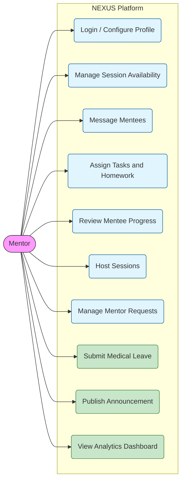

**Mentee Use Case Diagram**
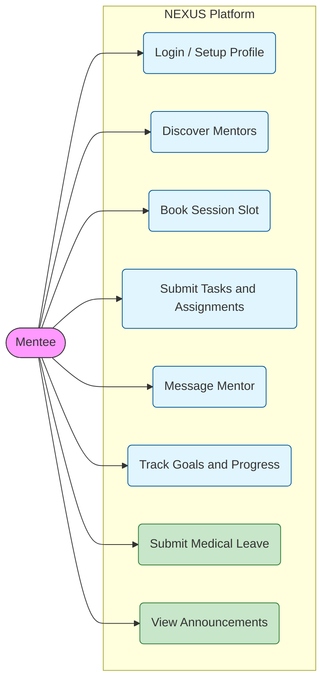

**Admin Use Case Diagram**
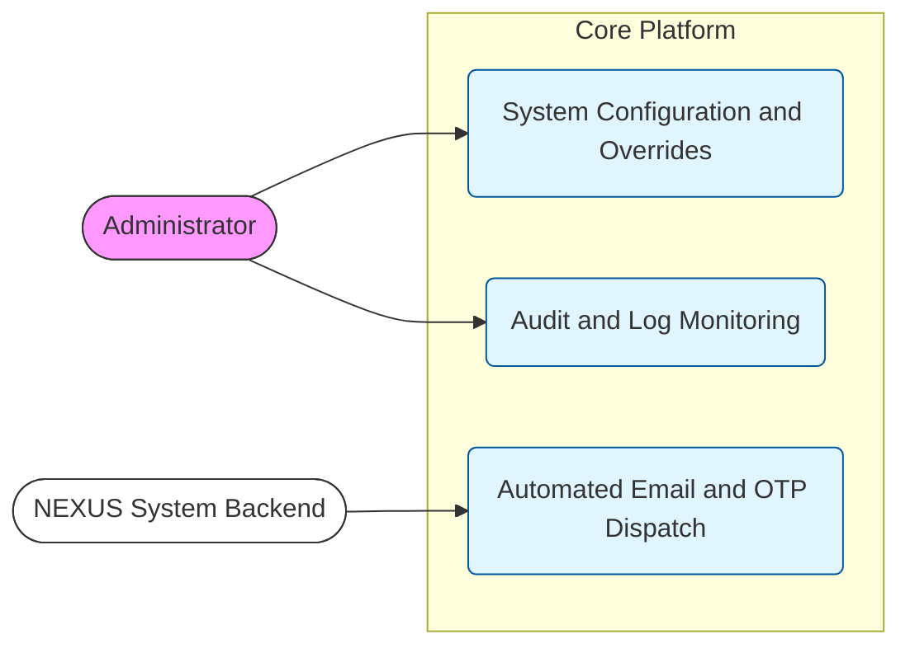

### A.2 Session Booking Sequence
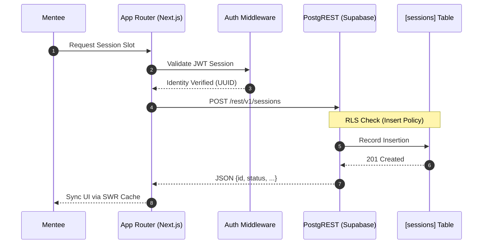

### A.3 Data Flow Diagrams (DFD)

**DFD Level 0: Context Diagram**
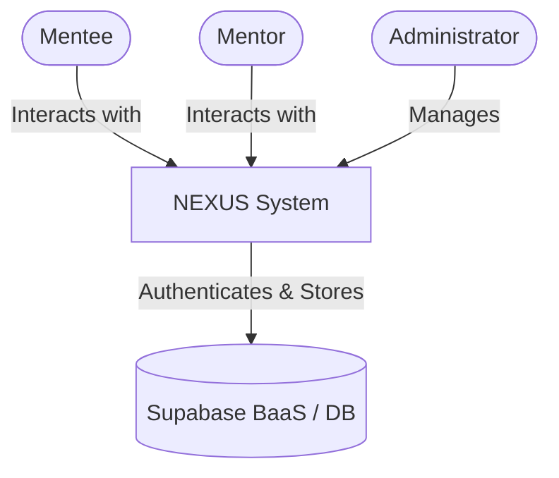

**DFD Level 1: Functional Decomposition**
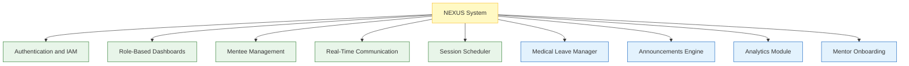

**DFD Level 2: Session Booking Process**
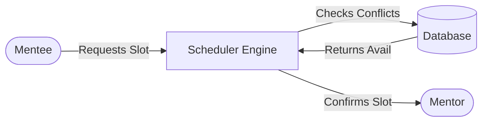

### A.4 Deployment Architecture

**System Architecture (Deployment View)**
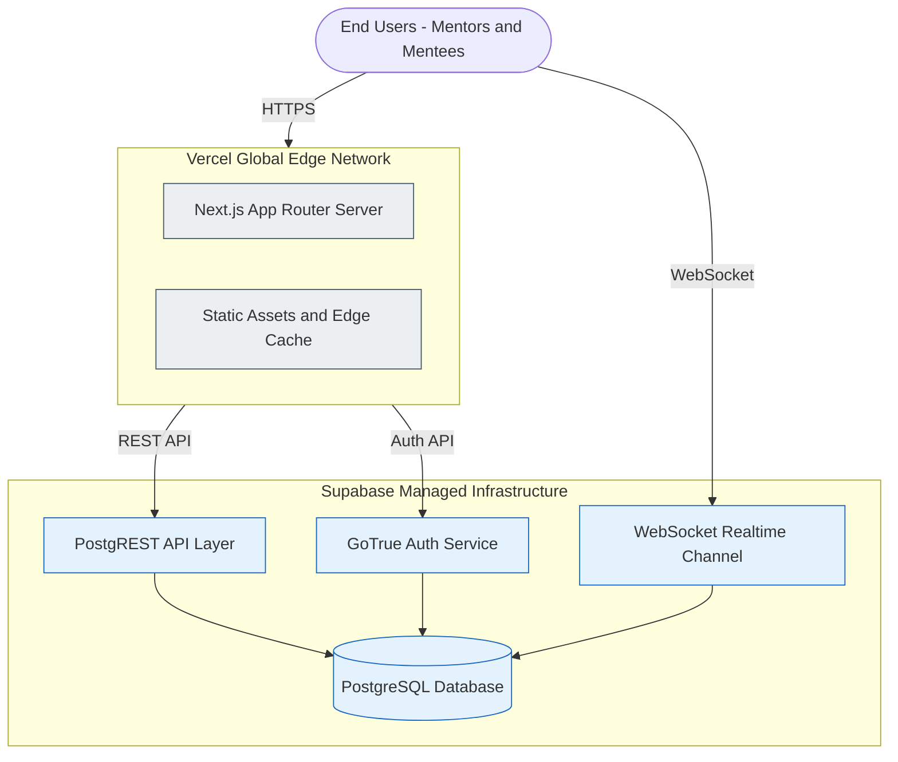

### A.5 Logical Component Diagram

This diagram illustrates the fully updated modular decomposition of the NEXUS v4.5 platform, highlighting all frontend UI components, service logic modules, and the data persistence layer, including all new system additions.

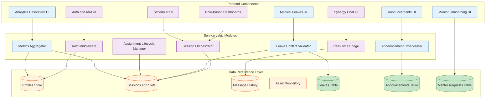

---

### A.6 Activity Diagram (Session Booking Flow)

This diagram describes the dynamic behavior of the system during a session booking activity, including user decisions and system validations.

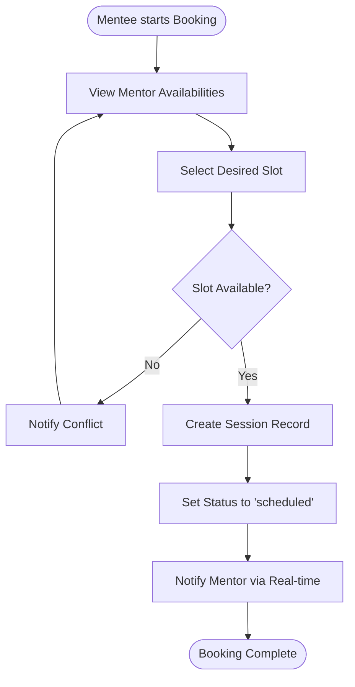

---

### A.7 State Diagram (Assignment Lifecycle)

This diagram tracks the various states of an assignment from creation to final review.

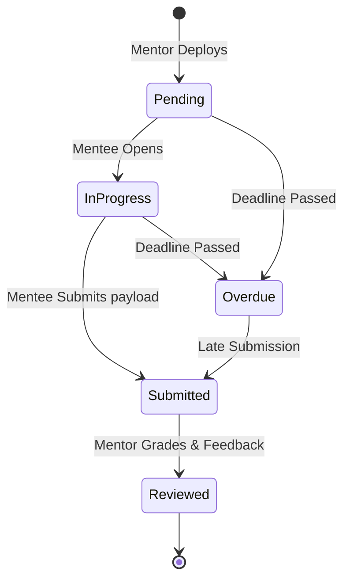

---

### A.8 State Diagram (Leave Request Lifecycle)

This diagram tracks the lifecycle of a Medical Leave absence request from submission to completion.

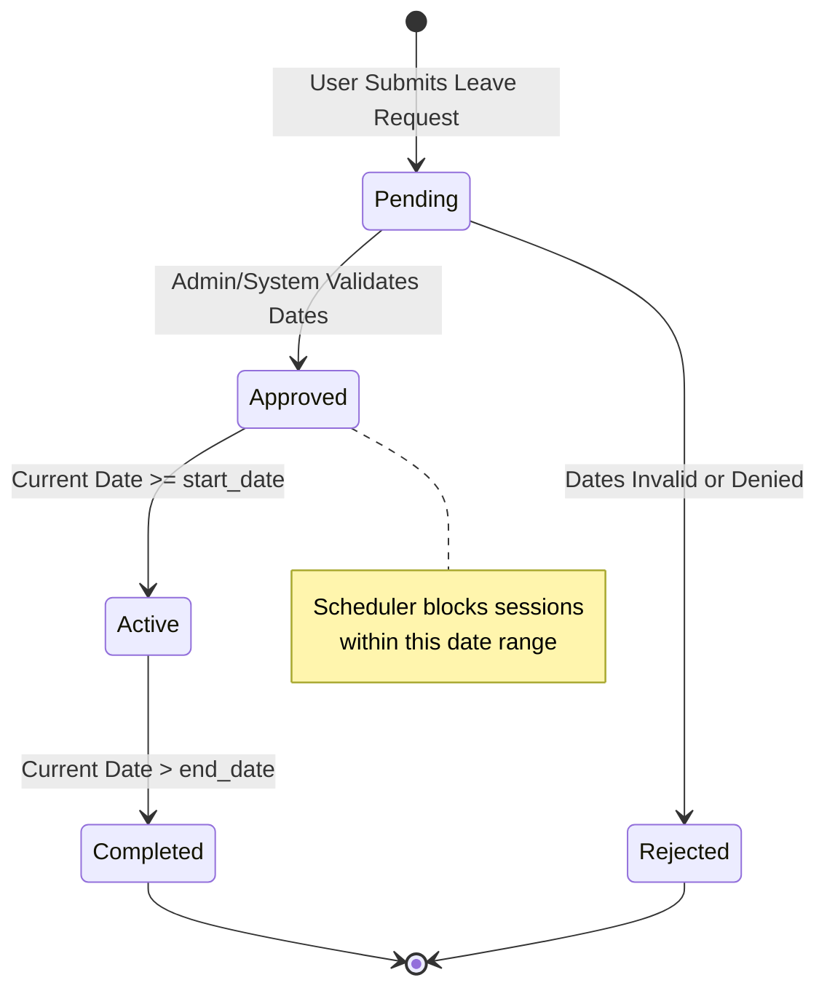

---

### A.9 Sequence Diagram (Leave Submission Flow)

This sequence diagram illustrates the full server-side flow when a user submits a Medical Leave request, including validation, conflict detection, and the downstream scheduler impact.

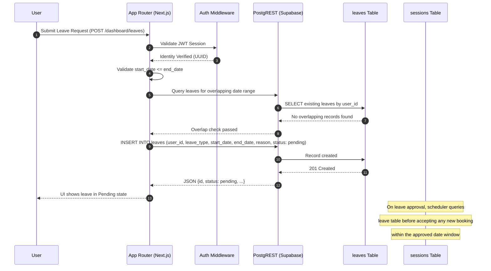

---

## Appendix B: Full-Fidelity Database ERD (v4.5)

This Entity Relationship Diagram (ERD) defines the complete logical schema of the NEXUS v4.5 platform, strictly enforced via Supabase PostgreSQL with Row-Level Security (RLS) enabled on every table.

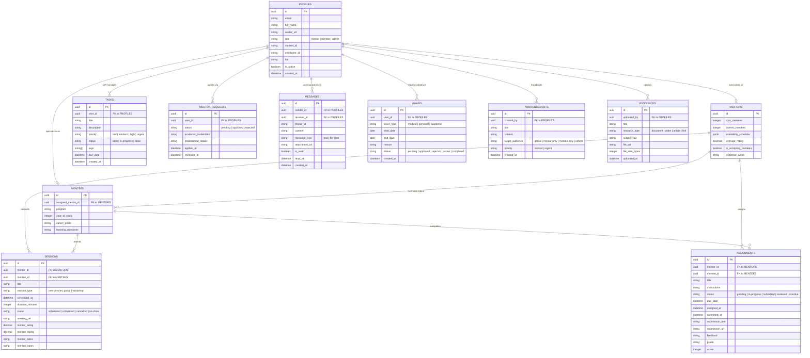

---

## Appendix C: High-Level Class Architecture

Constructed directly from the codebase architecture, this diagram defines the Object-Oriented Programming (OOP) framework mirroring the database relationships. v4.5 additions are highlighted with full class members.

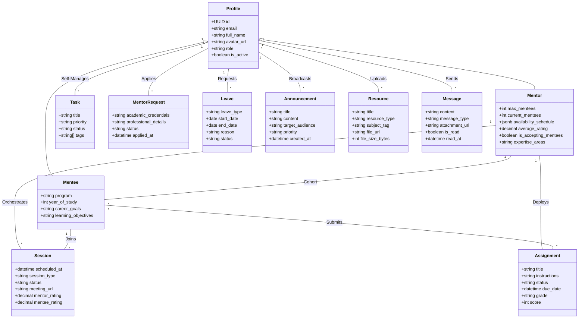

---

## Appendix D: Glossary

| Term | Definition |
| :--- | :--- |
| **AES-256** | Advanced Encryption Standard (256-bit). The encryption algorithm used by Supabase for data at rest. |
| **BaaS** | Backend as a Service. The software model where backend logic is managed by a third party (Supabase). |
| **CSRF** | Cross-Site Request Forgery. A web security vulnerability mitigated natively by Next.js middleware. |
| **ERD** | Entity Relationship Diagram. A visual model of the underlying database schema and its relationships. |
| **GoTrue** | The open-source Supabase authentication server utilized for managing JWTs and Magic Links. |
| **HOC** | Higher-Order Component. A React pattern used in `ProtectedRoute.tsx` to wrap pages with security logic. |
| **ISR** | Incremental Static Regeneration. A Next.js feature that allows updating static content without a full rebuild. |
| **JWT** | JSON Web Token. A compact, URL-safe means of representing claims transferred between two parties. |
| **KPI** | Key Performance Indicator. A measurable value used in the analytics module to evaluate platform health. |
| **PgBouncer** | A PostgreSQL connection pooler used by Supabase to handle concurrent database connections efficiently. |
| **PITR** | Point-in-Time Recovery. A Supabase/AWS feature enabling database restoration to any specific timestamp. |
| **PostgREST** | A standalone web server that turns a PostgreSQL database directly into a RESTful API. |
| **RBAC** | Role-Based Access Control. The framework preventing Mentees from accessing Mentor-specific features and vice versa. |
| **RLS** | Row-Level Security. A PostgreSQL security feature that restricts which rows a user can see based on their UUID identity. |
| **RSC** | React Server Components. Next.js paradigm where components render server-side, reducing client JS bundle size. |
| **SWR** | Stale-While-Revalidate. A React hook library for data fetching, ensuring fast UI updates with cached data. |
| **TLS 1.3** | Transport Layer Security (version 1.3). The protocol securing all HTTPS and WSS communications. |
| **TOTP** | Time-based One-Time Password. An MFA algorithm planned for future phased implementation. |
| **TTI** | Time To Interactive. A performance metric; NEXUS targets < 1.5 seconds on standard connections. |
| **Waterfall Model** | A linear and sequential software development approach where each phase completes before the next begins. |
| **WebRTC** | Web Real-Time Communication. A future planned protocol for browser-native video conferencing. |
| **wss://** | WebSocket Secure. The protocol used by Supabase Realtime for encrypted real-time data push events. |

---

## Appendix E: SDLC Documentation (Waterfall Phases)

The development of NEXUS strictly adheres to the Waterfall lifecycle to ensure architectural stability and data security.

### E.1 Requirements Analysis Phase
**Objective**: Define the full scope of the Mentor-Mentee relationship and technical constraints of all 12 platform modules.
- **Inputs**: Stakeholder interviews, academic mentorship guidelines, UI/UX prototype reviews, codebase gap analysis.
- **Outputs**: Finalized SRS v4.5-PLATINUM, Persona definitions, Feature-prioritized requirements list, Risk register.

### E.2 System Design Phase
**Objective**: Blueprint the complete frontend component tree and full backend relational schema including all v4.5 modules.
- **Architecture**: Next.js App Router for server-side rendering and React Server Components.
- **Database**: Supabase PostgreSQL 15+ with RLS enabled on all 12 tables; ERD defined in Appendix B.
- **UI/UX**: Tailwind CSS v4 with glassmorphism design system, responsive grid layouts, and dark mode.
- **Real-time Strategy**: Supabase Realtime channels used for Messages, Announcements, and Leave status updates.

### E.3 Implementation Phase
**Objective**: Full-stack development of all features defined in Sections 3.1–3.12.
- **Frontend**: Component-level UI development using React Server Components and Client Components in the App Router.
- **Backend**: Full SQL schema execution with RLS policies, PostgREST API auto-configuration, and database triggers.
- **Real-time**: WebSocket channel subscription for Synergy Messaging, Announcements broadcast, and leave status push.
- **Auth**: GoTrue-powered Magic Link and email/password auth with `handle_new_user()` DB trigger for profile sync.

### E.4 Integration & Testing Phase
**Objective**: Verify the seamless interaction of all modules across the full request lifecycle.
- **Unit Testing**: Validating profile creation, role assignment, and leave date validation logic.
- **Integration Testing**: Testing Scheduler conflict resolution, Leave-Scheduler overlap blocking, and Realtime broadcast delivery.
- **Security Testing**: RLS policy verification confirming cross-user data isolation for all 12 tables.
- **User Acceptance Testing (UAT)**: Faculty review of the Dashboard metrics, Analytics dashboard, and Announcement targeting.

### E.5 Deployment & Maintenance Phase
**Objective**: Global delivery and long-term health monitoring.
- **Hosting**: Vercel Edge Network with global CDN distribution and automatic preview deployments.
- **Backups**: Daily PITR snapshots and automated database backups via Supabase managed infrastructure.
- **Monitoring**: Real-time error tracking via Vercel Error Logs, Supabase query performance monitoring.
- **Iteration**: Post-deployment user feedback integration and incremental feature rollouts for Phase 2 items.

---

## Appendix F: Submission & Presentation Checklist

To ensure a flawless submission and presentation of the NEXUS v4.5 platform, the development team must verify all of the following before finalizing:

**Core Infrastructure**
- [ ] **Credential Integrity**: Verify that `.env.local` contains valid Supabase URL and Anon Key.
- [ ] **RLS Verification**: Confirm that Row-Level Security is enabled on **all** tables: Profiles, Mentors, Mentees, Sessions, Assignments, Tasks, Messages, Leaves, Announcements, Resources, Mentor_Requests.
- [ ] **Auth Trigger**: Ensure the `handle_new_user()` PostgreSQL trigger exists and correctly syncs new `auth.users` into the `public.profiles` table.
- [ ] **Role Routing**: Verify that login redirects Mentors to `/dashboard/mentor` and Mentees to `/dashboard/mentee` without fallback loop.

**Feature Verification**
- [ ] **Real-time Messaging**: Test that messages appear instantly across two distinct browser sessions under the same mentor-mentee pair.
- [ ] **Leave Blocking**: Submit a leave for today's date and verify that session booking within the leave window returns a conflict error.
- [ ] **Announcements Broadcast**: Publish a global announcement and confirm it appears in real-time on a second logged-in session.
- [ ] **Analytics Accuracy**: Cross-check the analytics dashboard session count against the raw `sessions` table count in Supabase.
- [ ] **Mentor-Join Flow**: Submit a new mentor application via `/mentor-join` and confirm the record lands in `mentor_requests` with status `pending`.
- [ ] **Resource Upload**: Upload a < 10MB PDF and verify it appears in the Resource Repository for the assigned mentee.
- [ ] **Settings Update**: Change `full_name` from the Settings page and verify the update reflects immediately on the dashboard.

**Deployment & Quality**
- [ ] **Build Health**: Verify that `next build` completes without TypeScript errors or unresolved module warnings.
- [ ] **Deployment State**: Confirm the latest `main` branch is successfully deployed on Vercel without trailing slash or 404 errors.
- [ ] **Responsive UI**: Test all 11 dashboard routes on a 375px mobile viewport and confirm no layout overflow.
- [ ] **Diagram Parity**: Confirm the ERD in Appendix B of this SRS matches all table definitions in the Supabase Table Editor.
- [ ] **SRS Version Tag**: Ensure document header reads Version `4.5.0-PLATINUM` and reference code `SRS_NEXUS_V4.5_May_2025`.

---
*End of NEXUS Mentor-Mentee Platform SRS v4.5.0-PLATINUM Document.*
*Prepared by: Pari Chaudhari · Arya Shah · Harsh Patel · Het Gabani — May 2025*
